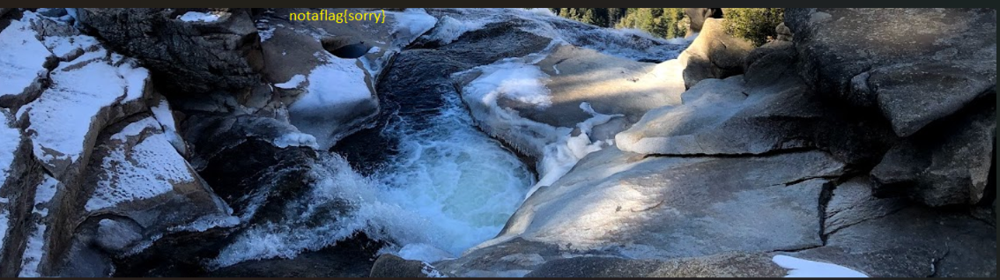

# Forensic Challengs
 

## Challenge-1 trivial flag transfer protocol
`flag` `picoCTF{h1dd3n_1n_pLa1n_51GHT_18375919}`
 

### Steps I did
1:- Ok since it is `pcapng` file I download `wireshark` and use that to open it and find what is going on

2:- I don't understand what the fuck is gong on here so I just extract the objects used here and I find the following file
    instructions.txt
    plan
    program.deb
    picture1.bmp
    picture2.bmp
    picture3.bmp

3:- `plan` and `instructions.txt` seem to contain some form of cipher so I will analyse it later. Meanwhile I painstackingkly used chatgpt to analyse what is this `deb` file. I do `sudo dpkg -i /mnt/f/Cryptonite_taskphase2_Mrinal/Forencics/ch1/program.deb` to install the deb file but it seems to be giving some error as `libjpeg62-turbo` is not available

4:- So I try to analyse  the available packages using
    apt search libjpeg62
    apt search libmcrypt
    apt search libmhash
 and learn that it is available as `libjpeg62/noble` so install that by doing `sudo apt-get install libjpeg62`

5:- I have that but `steghide` still requires `libjpeg62-turbo` so I fix the broken package using `sudo apt --fix-broken install`

6:- tRYING TO configure it by using `sudo dpkg --configure steghide` but still getting error so again we fix the installation using `sudo apt-get install -f` and use `steghide --version` if our program is working or not

7:- Analyzing the deb file we learn that it's `steghide` file which is used to stoire data in the east significant bits of other files (like the `bmp` we have)

8:- I use the stegnograph `steghide extract -sf picture1.bmp` but it seems to be asking for a passphrase

9:- So i analyze the instructions and plan cipher and it seems to be `ROT-13` (Yes I tried caeasar vignere and god know how many different encoding)

10:- Using `DUEDILIGENCE` as the passphrase gives us the flag

### Mistakes I made

### Things I learned

  

### Challenge-2 tunn3l v1s10n
We get an unidentified image
 To find more about it i go to `filext.com` to find more about the image

I see that it can be a bmp file. So i use

    snorlux@MrinalPC:/mnt/f/Cryptonite_taskphase2_Mrinal/Forencics/ch2$ identify  tunn3l_v1s10n
    tunn3l_v1s10n BMP 1134x306+0+0 DirectClass 8-bit 2.8Mi 0.000u 0m:0.000004s

Thus confirming it's bmp file

Now, what change it's extension to `.bmp` but the file is corrupted

So I use hex editor and chatgpt to edit it's header and hid header data and viola the image is now visible

