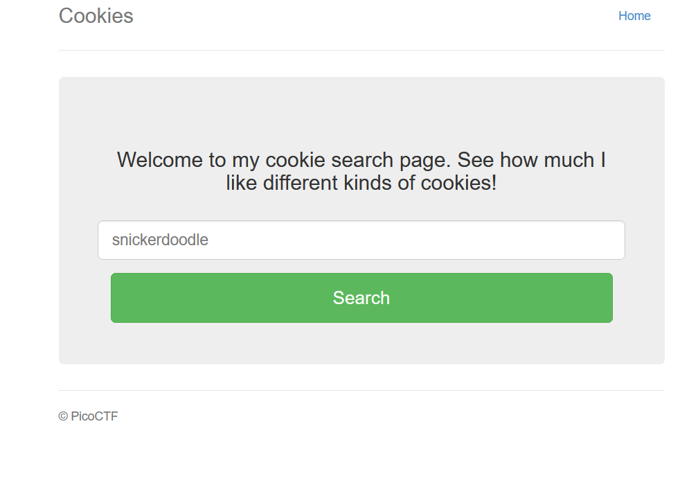
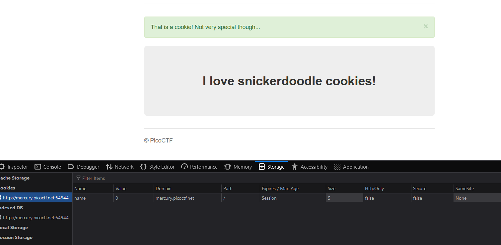
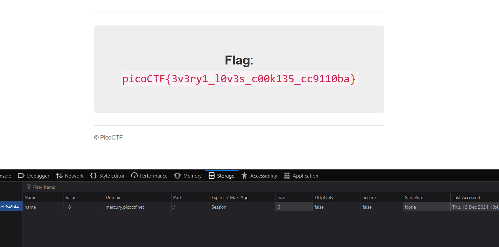

# Web EXploitation
<br><br>

## Challenge-1 SOAP
I checked the hint and this involved a XXE injection, I just went over to Advent of Cyber Day 5 which covered the same topic and after learning from there I did the exact same thing here!

I launched BurpSuite and turned on Intercept Mode, when I clicked on detail and inspected the intercepted request I could see XML code written, I injected this:-

```
<?xml version="1.0" encoding="UTF-8"?>
<!DOCTYPE foo [<!ENTITY payload SYSTEM "file://etc/passwd"> ]>
<data>
  <ID>
      &payload;
  </ID>
</data>
```

and got the output which contained the flag
`flag` `picoCTF{XML_3xtern@l_3nt1t1ty_4dbeb2ed}`

### Things I learned
XXE injection use

## Challenge-2 Forbidden Paths
### Steps to get the flag
1:- starting the instance and goign to webiste we reach a from type of webpage where we can type the txt file as in input and submit

2:- I check if we are in the directory where files are avaialbel or not by using `./oliver.txt`

3:- We are in the right directory. So to get to the currect level we do `../../../../flag.txt` because of the hint that files  exist in `/usr/share/nginx/html/` which is our current directory

4:- our step gives us the correct flag
`flag` `picoCTF{7h3_p47h_70_5ucc355_e5fe3d4d}`
<br>

### Mistakes i made
I tried to go to `/usr/share/nginx/html/` not realising that this is where we already are and my mehtod didn't work, I don't know why?
<br>

### Things I learned
just like our pwn challenges in pwncollege we have similar concepts of relative and absolute path when it comes webpages
methods like `../../../` helps goes back in the level to reach the root directory
<br><br>

## Challenge-3 cookies

### Steps for the challenge
On cliclking the web link we come across a website `http://mercury.picoctf.net:64944` witht home screen that looks like this



It checks for valid cookie names and redirects you to `http://mercury.picoctf.net:64944/check`

On inspecting the cookies, we see that it has only value called `name` that changes from `-1` to `0` on adding snickerdoodle in the home page



On changing the value we get our flag at the value 18


<br>

### Things i learned
earned editing cookie values can change the website
